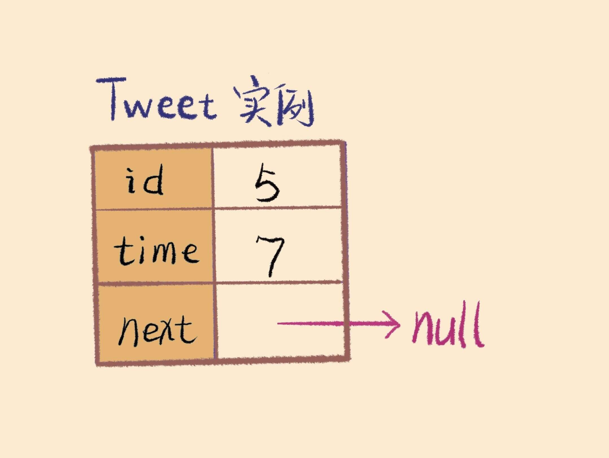
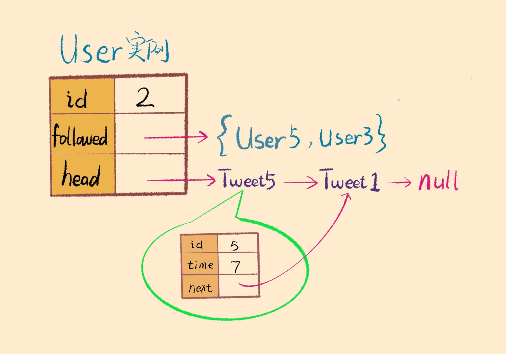

## [355. 设计推特](https://leetcode.cn/problems/design-twitter/)

**设计一个简化版的推特(Twitter)，可以让用户实现发送推文，关注/取消关注其他用户，能够看见关注人（包括自己）的最近 **`10` 条推文。

**实现 **`Twitter` 类：

* `Twitter()` 初始化简易版推特对象
* `void postTweet(int userId, int tweetId)` 根据给定的 `tweetId` 和 `userId` 创建一条新推文。每次调用此函数都会使用一个不同的 `tweetId` 。
* `List<Integer> getNewsFeed(int userId)` 检索当前用户新闻推送中最近 `10` 条推文的 ID 。新闻推送中的每一项都必须是由用户关注的人或者是用户自己发布的推文。推文必须 **按照时间顺序由最近到最远排序** 。
* `void follow(int followerId, int followeeId)` ID 为 `followerId` 的用户开始关注 ID 为 `followeeId` 的用户。
* `void unfollow(int followerId, int followeeId)` ID 为 `followerId` 的用户不再关注 ID 为 `followeeId` 的用户。

**示例：**

```
输入
["Twitter", "postTweet", "getNewsFeed", "follow", "postTweet", "getNewsFeed", "unfollow", "getNewsFeed"]
[[], [1, 5], [1], [1, 2], [2, 6], [1], [1, 2], [1]]
输出
[null, null, [5], null, null, [6, 5], null, [5]]

解释
Twitter twitter = new Twitter();
twitter.postTweet(1, 5); // 用户 1 发送了一条新推文 (用户 id = 1, 推文 id = 5)
twitter.getNewsFeed(1);  // 用户 1 的获取推文应当返回一个列表，其中包含一个 id 为 5 的推文
twitter.follow(1, 2);    // 用户 1 关注了用户 2
twitter.postTweet(2, 6); // 用户 2 发送了一个新推文 (推文 id = 6)
twitter.getNewsFeed(1);  // 用户 1 的获取推文应当返回一个列表，其中包含两个推文，id 分别为 -> [6, 5] 。推文 id 6 应当在推文 id 5 之前，因为它是在 5 之后发送的
twitter.unfollow(1, 2);  // 用户 1 取消关注了用户 2
twitter.getNewsFeed(1);  // 用户 1 获取推文应当返回一个列表，其中包含一个 id 为 5 的推文。因为用户 1 已经不再关注用户 2
```

**提示：**

* `1 <= userId, followerId, followeeId <= 500`
* `0 <= tweetId <= 104`
* **所有推特的 ID 都互不相同**
* `postTweet`、`getNewsFeed`、`follow` 和 `unfollow` 方法最多调用 `3 * 104` 次

## 解答

```
class Twitter {
    // 全局时间戳
    int globalTime = 0;
    // 记录用户 ID 到用户示例的映射
    HashMap<Integer, User> idToUser = new HashMap<>();

    // Tweet 类
    class Tweet {
        private int id;
        // 时间戳用于对信息流按照时间排序
        private int timestamp;
        // 指向下一条 tweet，类似单链表结构
        private Tweet next;

        // 构造方法
        public Tweet(int id) {
            this.id = id;
            // 注意：新建一条 tweet 时记录并更新时间戳！
            this.timestamp = globalTime++;
            this.next = null;
        }

        public int getId() {
            return id;
        }

        public int getTimestamp() {
            return timestamp;
        }

        public Tweet getNext() {
            return next;
        }

        public void setNext(Tweet next) {
            this.next = next;
        }
    }

    // 用户类
    class User {
        // 记录该用户的 id 以及发布的 tweet
        private int id;
        private Tweet tweetHead;
        // 记录该用户的关注者
        private HashSet<User> followedUserSet;
        
        // 构造方法
        public User(int id) {
            this.id = id;
            this.tweetHead = null;
            this.followedUserSet = new HashSet<>();
        }

        public int getId() {
            return id;
        }

        public Tweet getTweetHead() {
            return tweetHead;
        }

        public HashSet<User> getFollowedUserSet() {
            return followedUserSet;
        }

        public boolean equals(User other) {
            return this.id == other.id;
        }

        // 关注其他人
        public void follow(User other) {
            followedUserSet.add(other);
        }

        // 取关其他人
        public void unfollow(User other) {
            followedUserSet.remove(other);
        }

        // 发布一条 tweet
        public void post(Tweet tweet) {
            // 把新发布的 tweet 作为链表头节点
            tweet.setNext(tweetHead);
            tweetHead = tweet;
        }
    }

    public void postTweet(int userId, int tweetId) {
        // 如果这个用户还不存在，新建用户
        if (!idToUser.containsKey(userId)) {
            idToUser.put(userId, new User(userId));
        }
        User user = idToUser.get(userId);
        // 先实例化一个 Tweet，再调用 user 实例的 post 方法
        user.post(new Tweet(tweetId));
    }

    public List<Integer> getNewsFeed(int userId) {
        List<Integer> res = new LinkedList<>();
        if (!idToUser.containsKey(userId)) {
            return res;
        }
        // 获取该用户关注的用户列表
        User user = idToUser.get(userId);
        Set<User> followedUserSet = user.getFollowedUserSet();

        // 初始化优先级队列
        // 每个用户的 tweet 是一条按时间排序的链表
        PriorityQueue<Tweet> pq = new PriorityQueue<>((a, b) -> {
            // 按照每条 tweet 的发布时间降序排序（最近发布的排在事件流前面）
            return b.timestamp - a.timestamp;
        });
        // 该用户自己的 tweet 也在时间线内
        if (user.getTweetHead() != null) {
            pq.offer(user.getTweetHead());
        }
        // 遍历自己关注的所有用户
        for (User other : followedUserSet) {
            // 如果该用户发表过 tweet，就把他的 tweet 链表的头节点添加到优先级队列里
            if (other.getTweetHead() != null) {
                pq.offer(other.tweetHead);
            }
        }
        
        // 合并多条有序链表
        int count = 0;
        while (!pq.isEmpty() && count < 10) {
            // 弹出队首元素
            Tweet tweet = pq.poll();
            // 添加到结果链表里。
            res.add(tweet.getId());
            // 刚才弹出了一个元素，所以需要看它后面还有没有元素，如果有，就把它添加到队列里。
            if (tweet.getNext() != null) {
                pq.offer(tweet.getNext());
            }
            // count 指的是 res 里的元素的个数
            count++;
        }
        return res;
    }

    public void follow(int followerId, int followeeId) {
        // 如果用户还不存在，则新建用户
        if (!idToUser.containsKey(followerId)) {
            idToUser.put(followerId, new User(followerId));
        }
        if (!idToUser.containsKey(followeeId)) {
            idToUser.put(followeeId, new User(followeeId));
        }

        User follower = idToUser.get(followerId);
        User followee = idToUser.get(followeeId);
        // 调用 user 实例的 follow 方法
        follower.follow(followee);
    }

    public void unfollow(int followerId, int followeeId) {
        if (!idToUser.containsKey(followerId) || !idToUser.containsKey(followeeId)) {
            return;
        }
        
        User follower = idToUser.get(followerId);
        User followee = idToUser.get(followeeId);
        // 调用 user 实例的 unfollow 方法
        follower.unfollow(followee);
    }
}
```

## 分析（和解答有点出入）

### 框架

```
class Twitter {
    private static int timestamp = 0;
    private static class Tweet {}
    private static class User {}

    /* 还有那几个 API 方法 */
    public void postTweet(int userId, int tweetId) {}
    public List<Integer> getNewsFeed(int userId) {}
    public void follow(int followerId, int followeeId) {}
    public void unfollow(int followerId, int followeeId) {}
}
```

### 为什么要把 Tweet 和 User 类放到 Twitter 类里？

**因为 Tweet 类必须要用到一个全局时间戳 timestamp，而 User 类又需要用到 Tweet 类记录用户发送的推文，所以它们都作为内部类。**

### 如何实现 Tweet 类？

**每个 Tweet 实例需要记录自己的 tweetId 和发表时间 time，而且作为链表节点，要有一个指向下一个节点的 next 指针。**

```
class Tweet {
    private int id;
    private int time;
    private Tweet next;

    // 需要传入推文内容（id）和发文时间
    public Tweet(int id, int time) {
        this.id = id;
        this.time = time;
        this.next = null;
    }
}
```



### 如何实现User类？

**一个用户需要存储的信息有 userId，关注列表，以及该用户发过的推文列表。其中关注列表应该用集合（Hash Set）这种数据结构来存，因为不能重复，而且需要快速查找；推文列表应该由链表这种数据结构储存，以便于进行有序合并的操作。**



**根据面向对象的设计原则，「关注」「取关」和「发文」应该是 User 的行为，况且关注列表和推文列表也存储在 User 类中，所以我们也应该给 User 添加 follow，unfollow 和 post 这几个方法。**

### 如何实现postTweet、follow和unfollow方法？

**利用 User 类的 follow，unfollow 和 post 方法。**

### 如何实现getNewsFeed方法？

**因为一个人会关注很多人，他关注的每个人都有一个tweet链表，所以我们需要把这些tweet链表合并，合并后的tweet链表是按照发布时间从新到旧进行排序的。**

**实现合并 k 个有序链表的算法需要用到优先级队列（Priority Queue），这种数据结构是「二叉堆」最重要的应用。**

```
class Twitter {
    /** 返回该 user 关注的人（包括他自己）最近的动态 id，
    最多 10 条，而且这些动态必须按从新到旧的时间线顺序排列。*/
    public List<Integer> getNewsFeed(int userId) {
        List<Integer> res = new ArrayList<>();
        if (!userMap.containsKey(userId)) return res;
        // 关注列表的用户 Id
        Set<Integer> users = userMap.get(userId).followed;
        // 自动通过 time 属性从大到小排序，容量为 users 的大小
        PriorityQueue<Tweet> pq = 
            new PriorityQueue<>(users.size(), (a, b)->(b.time - a.time));

        // 先将所有链表头节点插入优先级队列
        for (int id : users) {
            Tweet twt = userMap.get(id).head;
            if (twt == null) continue;
            pq.add(twt);
        }

        while (!pq.isEmpty()) {
            // 最多返回 10 条就够了
            if (res.size() == 10) break;
            // 弹出 time 值最大的（最近发表的）
            Tweet twt = pq.poll();
            res.add(twt.id);
            // 将下一篇 Tweet 插入进行排序
            if (twt.next != null) 
                pq.add(twt.next);
        }
        return res;
    }
}
```
